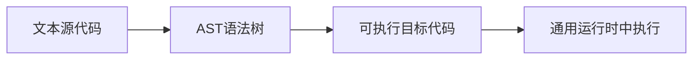
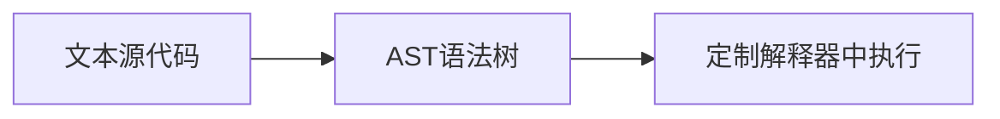

# 编写自己的（玩具）编程语言

本文将记录一个小型的玩具语言开发过程。作为学习实践 Rust 的副产品。

本过程将覆盖下面一些要点：

1. 解析文本格式的源代码。
2. 构建 AST（语法树）。
3. 从语法树翻译为可执行的目标代码。
4. 执行目标代码（作为验证）。



另外，也可能尝试改变为解释执行。



## 语言设计目标

第一阶段。语法非常简单，只要实现简单的算术表达式，类似于下面。

```
1 + 2
1 + 2 - 3
```

第二阶段， 实现变量。

```
let a = 2
let b = a + 2
b
```

第三阶段，实现简单的控制流。

```
let a = 0
let b = 0
if (a > 0) b = a + 2
b
```

第三阶段， 实现函数。

```
fn add(a) {
    if (a == 1) return 1
    return add(a - 1)
}
let b = add(10)
b
```

第四阶段， 实现简单的类型。

```
fn add(a:int) {
    if (a == 1) return 1
    return add(a - 1)
}
let b = add("10") // 编译错。
b
```

## 技术选型

1. 主体语言使用 Rust - 整个文章本就是作者学习 Rust 过程中的副产品。
2. 解析器使用 nom (https://github.com/Geal/nom) - nom 是 combinator 类解析库里面比较有代表性的。combinator 是以函数作为解析单位，反复组合形成整体解析。还有一种解析库是 PEG 类型的，也就是直接写出 PEG 文件定义语法，由库直接生成整体解析器。比如 pest (https://bitbegin.github.io/pest-rs/) 。之所以选择 combinator 主要是想多用 Rust 写代码。
3. 通用运行时 WASM - WASM 相对新潮、通用。能在多种平台上方便地运行。社区讨论也比较活跃。相关工具比较充足。
4. WASM 构建使用 parity_wasm (https://github.com/paritytech/parity-wasm) - 很方便的底层 WASM 构建。

## 一些要点

开发过程中遵循一些原则：

1. 每个语法阶段都完成全流程，从解析到可运行。
2. AST 驱动，而不是以 parser 的实现作为先决条件。因为 parser 实现复杂，容易陷入细节。
3. 多写测试。

## 开始

1. [第一阶段 ： 1+1=2](./doc/1.md)
1. [第二阶段 ： foo与bar](./doc/2.md)
