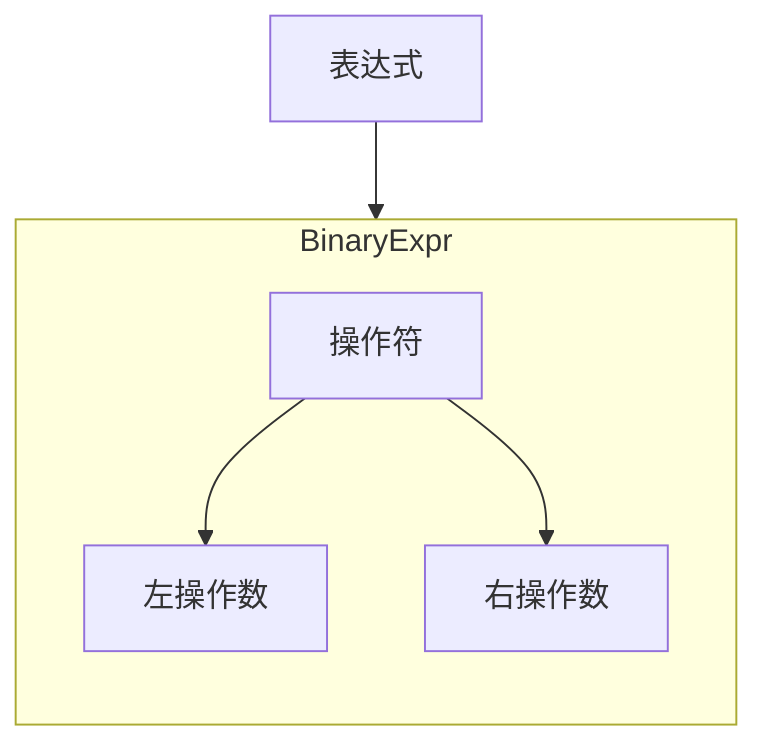
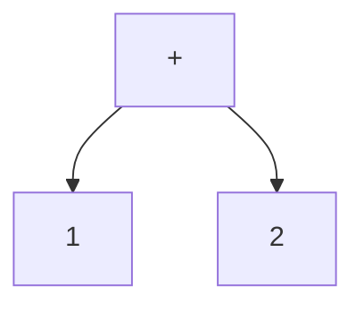
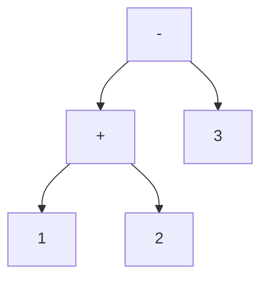
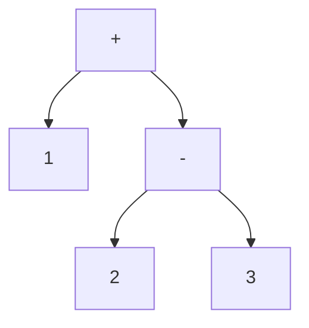

# 第一阶段：1+1=2

## 语法

本阶段的语法比较简单，概念上如下图。



对于

```
1 + 2
1 + 2 - 3
```





（图一）

```rust
#[derive(PartialEq, Debug)]
pub enum Operator {
    Plus,
    Minus,
}
#[derive(PartialEq, Debug)]
pub enum Expr {
    Int(i32),
    BinaryExpr {
        op: Operator,
        left: Box<Expr>,
        right: Box<Expr>,
    },
}
```

注意，AST 的结构与解析结果不一定是完全一一对应的。
比如， `1+2-3` 和 `(1+2)-3` 的 AST 结构都是简单的 BinaryExpr 来表示。
并不一定要把括号带到 AST 中。在 AST 构成的过程中已经处理了计算顺序的问题，
比如如果是`1+(2-3)`，就会是下面的不同 AST 结构，虽然最后计算这个算式的结果还是一样的。



大概在专业术语中这是两个不同的领域，分别叫编程语言的词法和语法，笔者没有认真学习过编译原理，此处简单提一下，不再纠结。

## 开发

项目目录结构如下，用 cargo new 直接生成就可以了。代码主要在`src`下面几个子目录，是几个子模块，分别在自己的目录，比如`ast`、`parsers`。

```tree
.
├── Cargo.lock
├── Cargo.toml
└── src
    ├── ast
    │   ├── compile.rs
    │   ├── mod.rs
    │   └── test.rs
    ├── main.rs
    ├── parsers
    │   ├── mod.rs
    │   └── test.rs
    ├── test.rs
    └── wasm
        ├── mod.rs
        └── test.rs
```

可以提一下的是单元测试文件的位置，类似于`./src/parsers/test.rs`，
按照官方建议 (https://rustwiki.org/zh-CN/book/ch11-03-test-organization.html) ，单元测试与被测试的代码放在同一个文件。这对相当看不得大文件的我来说非常不能接受。但跟被测试代码放在同一个 module 是赞成的，所以有了`./src/parsers`这个目录作为 parsers module 的目录，`mod.rs`里面是主代码，`test.rs`是对应的单元测试代码。`src`下面也有一个`test.rs`,算是根模块的测试吧。

### 整体过程

以下的代码在`./src/test.rs`，展现了从文本代码到运行结果的整个过程。里面的注释说明了每个步骤的工作。

```rust
fn string_to_result(){
    let s = "1+3-2";
    let exp = add_sub(s);
    assert!(exp.is_ok());   //解析字符串，生成AST。
    let ins = exp.unwrap().1.to_instructions();
    assert!(ins.len()>0);   //AST转换成WASM指令。
    let module = module_with_single_function(ins,None);
    assert!(module.sections().len()>0); //WASM指令放入一个WASM 模块中。
    let result = run_module(module);
    assert_eq!(result,RuntimeValue::I32(2)); //运行WASM模块并得到结果。
}
```

### 解析器

1. 解析器使用 nom，代码在`./src/parser`。
2. 其中有几个函数，来自于 nom 官方文档中的实例片段。很常用，也很有启发意义，
新手可以留意一下（https://docs.rs/nom/7.1.1/nom/recipes/index.html） 。
3. `ws`这个函数，官方片段中是`F: Fn(&'a str) -> IResult<&'a str, O, E>`，带来错误，我这里改成了`F: FnMut(&'a str) -> IResult<&'a str, O, E> `则顺利通过。应该是把限制改宽松了，但我暂时没有理解这个区别。留待后续补充。
4. combinator 风格的 parser 对于菜鸟来说比较难，像笔者这种……
5. 后续将尝试实现乘除（主要是优先级怎么实现比较纠结），括号等。

### AST 和编译

1. AST 及其编译的代码在`./src/ast`。
2. 本阶段语法简单，AST 结构也单一，没有什么难度。只要对 AST 树结构一个遍历，每个节点一对一简单翻译。

3. 因为 WASM 的执行是在一个“栈”上，指令放置的顺序跟树的后序遍历的顺序是吻合的。

   ```rust
    let ops = &mut left.to_instructions();
    ops.append(&mut right.to_instructions());
    ops.push(match op {
        &Operator::Plus => Instruction::I32Add,
        &Operator::Minus => Instruction::I32Sub,
    });
   ```

    这里的几个`append`、`push`是典型的命令式编程，让笔者不太习惯，我积极寻找在 rust 中函数式编程的例子。貌似有一本书叫“Functional Programming in Rust”，正在找。
这里所谓的命令式、函数式，解释一下 - 
   ```rust
   //命令式
   let vec=new Vec();
   vec.append(aVec);
   vec.append(bVec);
   vec.push(cItem);
   return vec;
   //函数式
   return (aVec).append(bVec).push(cItem)
   ```

3. WASM 的指令和模块结构要简单了解。要想WASM代码被执行，必须把指令组织在一个“模块”里。从目前阶段来说，只需要把模块看做一个透明的包装壳，里面是线性罗列的指令序列。所以目前 AST 编译步骤的结果，就是一个`Vec<Instruction>`。
    ```rust
    pub trait Compile {
        fn to_instructions(&self) -> Vec<Instruction>;
    }

    impl Compile for Expr {
    ....
    ```

### 运行 WASM

1. 在`./src/wasm`。
2. 这部分目前没什么可说的，都是直接抄的例子。只要上面“编译”得到的指令集正确，就能运行出来。


## 更新

后来又研究了“命令式、函数式”的问题，发现rust中，Iter似乎才是类似职责的承担者，可以改成这样 - 
```rust
empty()
.chain(left.to_instructions())
.chain(right.to_instructions())
.chain(once(match op {
    &Operator::Plus => Instruction::I32Add,
    &Operator::Minus => Instruction::I32Sub,
}))
.collect()
```
`chain`方法参数是`IntoIter`，凡是存在`into_iter`的结构都可以使用，不用每次显式调用`xxx.into_iter`。