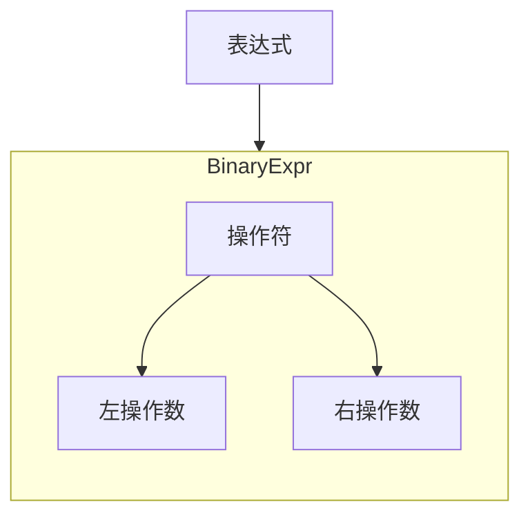
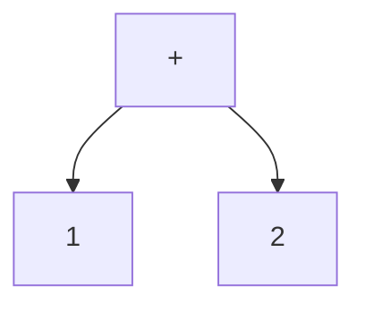
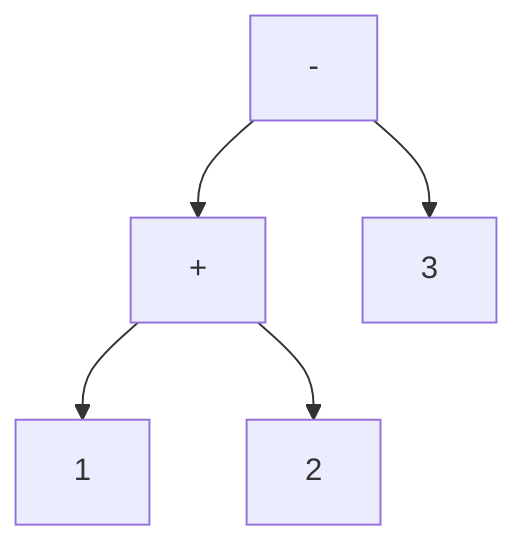
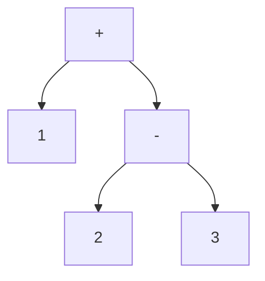

## 第一阶段

本阶段的语法比较简单，概念上如下图。



对于

```
1 + 2
1 + 2 - 3
```





（图一）

```rust
#[derive(PartialEq, Debug)]
pub enum Operator {
    Plus,
    Minus,
}
#[derive(PartialEq, Debug)]
pub enum Expr {
    Int(i32),
    BinaryExpr {
        op: Operator,
        left: Box<Expr>,
        right: Box<Expr>,
    },
}
```

注意，AST 的结构与解析结果不一定是完全一一对应的。
比如， `1+2-3` 和 `(1+2)-3` 的 AST 结构都是简单的 BinaryExpr 来表示。
并不一定要把括号带到 AST 中。在 AST 构成的过程中已经处理了计算顺序的问题，
比如如果是`1+(2-3)`，就会是下面的不同 AST 结构，虽然最后计算这个算式的结果还是一样的。



大概在专业术语中这是两个不同的领域，分别叫编程语言的词法和语法，我没有认真学习过编译原理，此处简单提一下，不再纠结。

```
├── Cargo.lock
├── Cargo.toml
├── README.md
├── src
│   ├── ast.rs
│   ├── main.rs
│   └── parsers
│       ├── mod.rs
│       └── test.rs
```
