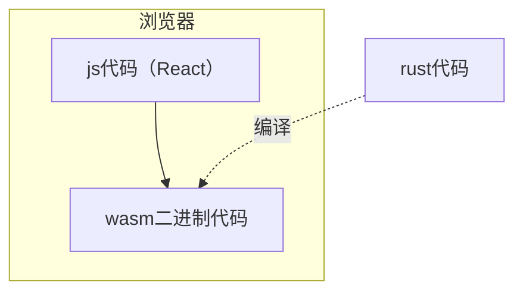
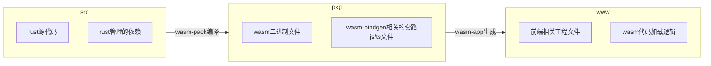
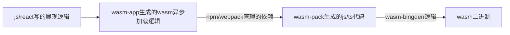

# 赠品 2.5 ： 一个 Web

如下图，这个 Web 是一个 Bian 语言的执行器。可以通过这里访问 - https://nielinjie.github.io/bian-lang/

在左边输入 bian 语言代码，右上部分是编译的中间结果，其中各数据在本系列的前几个文章中有解释。右下部分是运行结果。

下图描述了这个 Web 的构成，它作为一个 SinglePageApp，完全运行在浏览器中。从 URL 可以看到，这个 Web 部署在 github-page 上，没有后端支持，也不访问其他线上 api。

可能会问的两个问题：

1. 为何会要用 wasm/rust？ 因为整个系列都是学习和实践 rust 的副产物。可以编译为 wasm 在浏览器运行，以及其他很多种环境中运行，是 rust 的有趣特性之一，所以在这个方面的实践是必须的。
1. 为何有 React 的 js 部分，而不是纯 wasm/rust？ 确实有纯 rust 的前端框架，比如 https://yew.rs 。react（包括其他类似的 js 生态）有大量的部件积累，是有必要利用的。比如在我的这个 SPA 中，就用到了代码编辑器部件和 json 展示部件，这些都是 react 部件。而且 wasm 与 js 的交互，也是我希望体验的要点之一。

讲一下开发过程中使用的技术。

1. wasm。需要注意下，这篇文章中的wasm是在浏览器中运行编译器，而不是前几篇文章中，编译器把bian编译为wasm。这是wasm的两个不同应用场景。这两个wasm没有必然联系，可以是互不相同的两种格式。
1. rust 编译为 wasm 所需要的工具链。这些工具 rust 已经准备好了，`rustup target add wasm32-unknown-unknown`即可。rust 生态已经非常成熟丰富了。
1. 运行时 wasm 和 js 交互需用的库 - `wasm-bindgen` 这个库可以让 rust 的函数和数据结构（编译为 wasm 以后），从 js 中可以调用（反之亦可）。它需要在 rust 端加入依赖。参见代码`bian-front/src/lib.rs`。
1. 生成 wasm 与 js 交互的相关代码的工具 - `wasm-pack`，这个构建工具帮助生成`wasm-bindgen`相关的基础代码，包括编译 rust 为 wasm 和产生 js、ts 代码，产物都在`bian-front/pkg`，只需运行`wasm-pack build`。
1. 生成 wasm 和 wasm-bindgen 加载逻辑的工具 - `create-wasm-app`，这个工具在上一步的基础上，进一步生成了前端所需要的一些工程文件和依赖加载逻辑。生成了`bian-front/www`，只需运行`npm init wasm-app`

下面两个图，从构建时和运行时两个视角，描述了上面提到的技术和工具。

图一：构建时

图二：运行时

