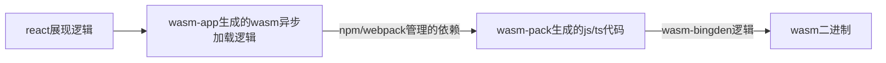

# 赠品 2.5 ： 一个 Web

如下图，这个Web是一个Bian语言的执行器。可以通过这里访问 - https://nielinjie.github.io/bian-lang/

在左边输入bian语言代码，右上部分是编译的中间结果，其中各数据在本系列的前几个文章中有解释。右下部分是运行结果。

下图描述了这个Web的构成，它作为一个SinglePageApp，完全运行在浏览器中。从URL可以看到，这个Web部署在github-page上，没有后端支持，也不访问其他线上api。

可能会问的两个问题：

1. 为何会要用wasm/rust？ 因为整个系列都是学习和实践rust的副产物。可以编译为wasm在浏览器运行，以及其他很多种环境中运行，是rust的有趣特性之一，所以在这个方面的实践是必须的。
1. 为何有React的js部分，而不是纯wasm/rust？ 确实有纯rust的前端框架，比如 https://yew.rs 。react（包括其他类似的js生态）有大量的部件积累，是有必要利用的。比如在我的这个SPA中，就用到了代码编辑器部件和json展示部件，这些都是react部件。而且wasm与js的交互，也是我希望体验的要点之一。

讲一下开发过程中使用的技术。
1. rust编译为wasm所需要的工具链。这些工具rust已经准备好了，`rustup target add wasm32-unknown-unknown`即可。rust生态已经非常成熟丰富了。
1. 运行时wasm和js交互需用的库 - `wasm-bindgen` 这个库可以让rust的函数和数据结构（编译为wasm以后），从js中可以调用（反之亦可）。它需要在rust端加入依赖。参见代码`bian-front/src/lib.rs`。
1. 生成wasm与js交互的相关代码的工具 - `wasm-pack`，这个构建工具帮助生成`wasm-bindgen`相关的基础代码，包括编译rust为wasm和产生js、ts代码，产物都在`bian-front/pkg`，只需运行`wasm-pack build`。
1. 生成wasm和wasm-bindgen加载逻辑的工具 - `create-wasm-app`，这个工具在上一步的基础上，进一步生成了前端所需要的一些工程文件和依赖加载逻辑。生成了`bian-front/www`，只需运行`npm init wasm-app`

下面两个图，从构建时和运行时两个视角，描述了上面提到的技术和工具。

图一：构建时

图二：运行时

