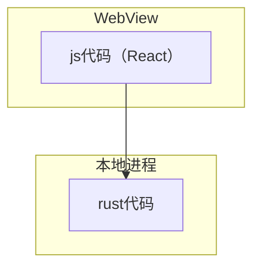

# 赠品 2.8 ： 一个 App

目前是一个桌面App，有在Mac上测试能跑。
它跟上一篇文章介绍的Web是同样的外观，因为展现逻辑代码完全是复用的。当然同样也是js/react写的。


它的构成如下图所示。js代码在本地webview中运行，负责展示逻辑和交互控制。rust代码在另外的本地进程中运行，负责其他逻辑，包括操作本地资源。


得到上述结构非常简单，利用`tauri`框架即可。这个框架跟`electron`是类似的，但几点不同很吸引人，目前风头正劲。

上篇文章介绍的wasm-bindgen负责js与wasm/rust的交互，大家可以看到使用起来略显复杂。在这里tauri却处理得相对简单。
rust端，一个attributes标记一个函数。直接完成，不需要自己处理序列化。
js端，一个异步函数即可调用，内部细节框架操心。

```rust
#[tauri::command]
fn compute_and_represent(code: String) -> (Result<CompilingRepresent, Error>, Result<i32, Error>) {
    let results = compute(code);
    let compiling_r = results.0.map(|c| CompilingRepresent::from_compiling(&c));
    (compiling_r, results.1)
}

```

```javascript
import { invoke } from "@tauri-apps/api/tauri";

export function compute(code){
    return invoke("compute_and_represent",{code}); //返回Promise
}
```